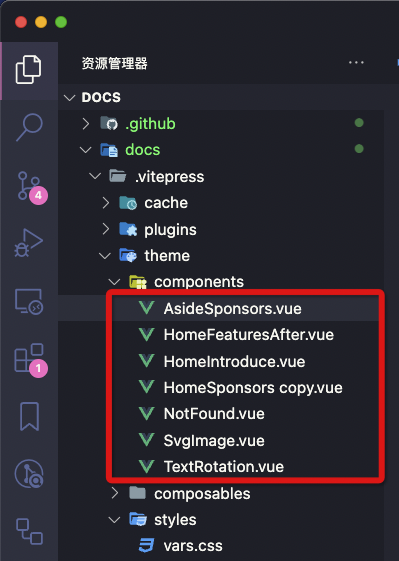

# vue 组件命名规范

> -   命名方式一：`kebab-case`，其中每个单词之间用连字符分隔，这种命名约定**更易读**，与 HTML 和 CSS 命名约定一致，并且更容易区分组件和项目目录中的其他文件。
> -   命名方式二：`PascalCase`，使用大驼峰命名法，**有利于自定义组件与 HTML 标签区分开来**。
>
> 推荐使用 `PascalCase` 命名方式，因为这样可以更好的区分自定义组件与 HTML 标签，而且**在使用 `PascalCase` 命名方式时，`kebab-case` 命名方式也可以正常使用。**

### 文件名称命名

推荐使用 `PascalCase` 命名方式，这样能在资源管理器中很好的区分文件夹、文件和 `vue` 组件。
::: tip
在 `vue` 脚手架创建的项目中，如果 `vue` 组件选项没有声明 `name` 属性，那么在 `vue` 脚手架编译时，会自动将 `vue` 组件的文件名作为 `name` 属性值。
:::



### 组件名称命名

组件名称强烈建议使用 `PascalCase` 命名方式，方便进行导入和定义组件。

::: warning
使用 `PascalCase` 命名方式定义组件时，在模板中可以同时兼容 `kebab-case` and `PascalCase` 命名方式，但是使用 `kebab-case` 命名方式时，只能在模板中使用 `kebab-case` 命名方式。
:::

```vue
<template>
    <div>
        <PascalCase></PascalCase>
    </div>
</template>
<script lang="ts" setup>
// Bad
import kebab-case from './PascalCase.vue';
// Good
import PascalCase from './PascalCase.vue';


// vue2
{
    components: {
        // Bad
        'kebab-case':PascalCase
        // Good
        PascalCase
    }
}
</script>
```

### 模板组件标签命名

模板中的组件标签，建议使用 `PascalCase` 命名方式，这样不仅能在 `vue` 组件模版 or `tsx` 中很好的区分组件和原生 `HTML` 标签。如果组件是单个单词命名，最好我们给组件标签加上前缀，如 `App` or `app-`，这样能避免与原生 `HTML` 标签冲突。

::: warning
以浏览器运行 `vue` 文件解析模板形式(不是过程化)，模板是交由浏览器先进行解析，然后再交由 `vue`，这时浏览器可能会错误的将 `PascalCase` 命名方式的组件标签解析为原生 `HTML` 标签，将 `PascalCase` 解析为小写，导致 `vue` 无法正确解析。但这是极少数的情况，通常我们是在 `vue` 脚手架中开发 `vue` 项目，所以不用担心这个问题。
:::
